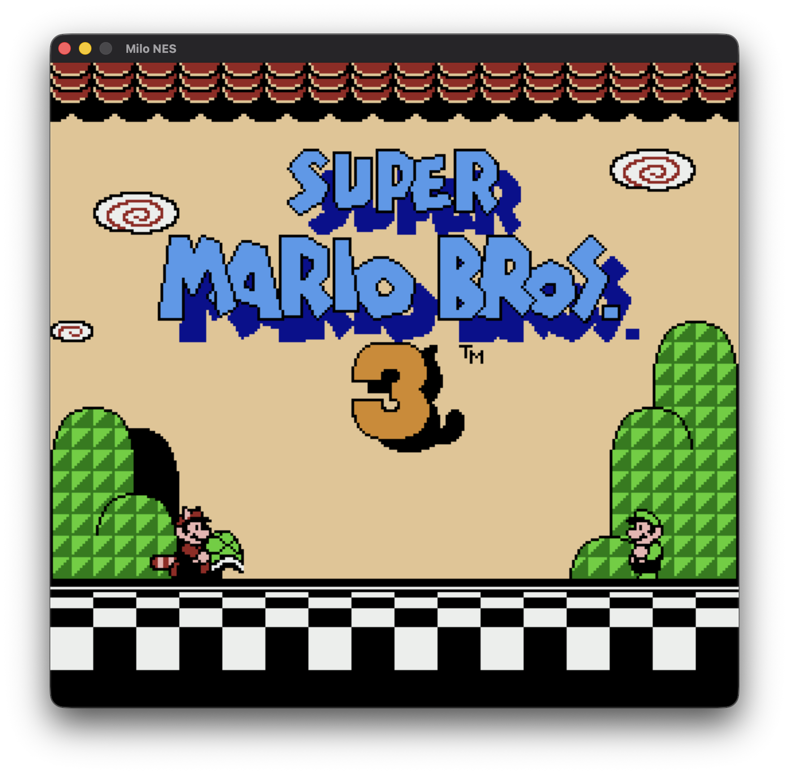
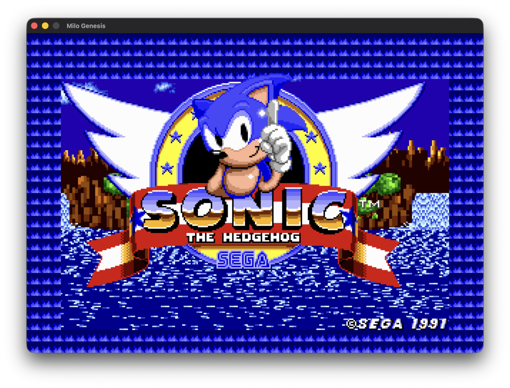
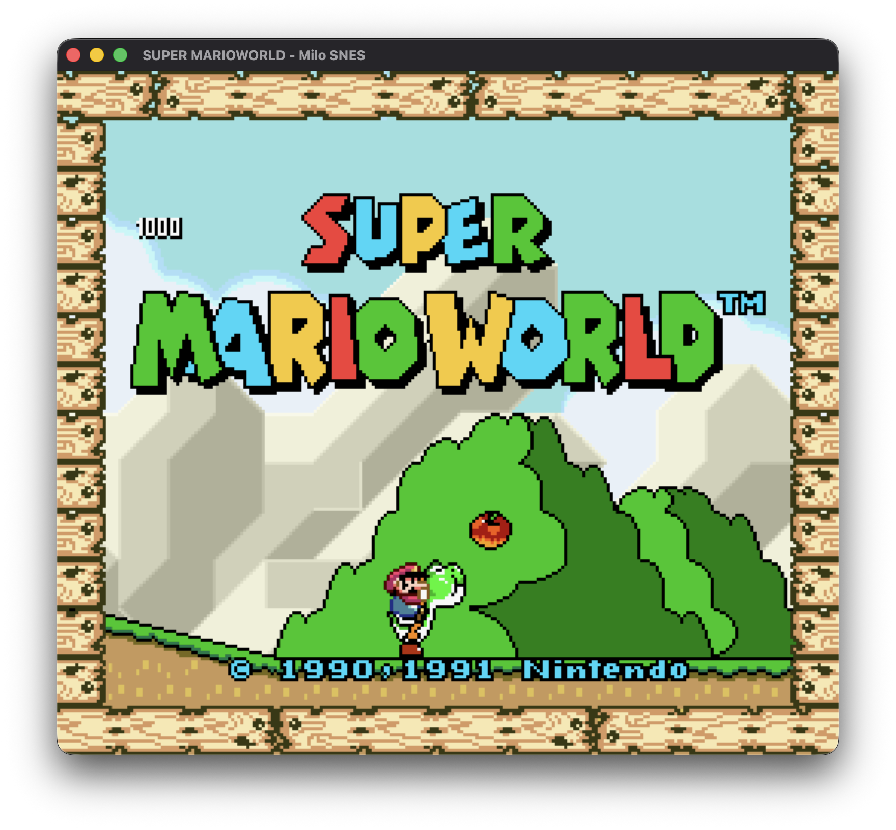

# Milo emulators

<p align="center">
  
  
  
</p>

NES, SNES, and Genesis emulators written in [Milo](https://github.com/milo-language/milo) — a
memory-safe systems language with no GC and no lifetime annotations. Cycle-driven CPU cores,
scanline PPU/VDP rendering, and audio, with SDL2 for video, sound, and input.

No `unsafe`. No garbage collector. Commercial games run at full speed.

**[Documentation](https://milo-language.github.io/milo/)** ·
**[Download a release](https://github.com/milo-language/emulators/releases/tag/latest)** —
SDL2 is statically linked, so nothing needs installing.

| Core | Directory | State |
| --- | --- | --- |
| NES | [`nes/`](nes) | Games play with audio. APU incl. DMC, multiple mappers. See [PROGRESS.md](nes/PROGRESS.md) |
| Genesis | [`genesis/`](genesis) | 68000 + Z80 + VDP. Sonic, Golden Axe, Aladdin play. See [PROGRESS.md](genesis/PROGRESS.md) |
| SNES | [`snes/`](snes) | Super Mario World and Donkey Kong Country play; Star Fox boots (Super FX/GSU). See [PROGRESS.md](snes/PROGRESS.md) |

Also here:

- **`retro/`** — a console front-end that builds all three cores and launches them from one menu
- **`shared/`** — SDL bindings, bitmap font, and menu core shared by the front-end
- **`menu.milo`** — fullscreen SDL ROM browser, scans `roms/{nes,genesis,snes}`
- **`arcade.sh`** — dispatches a ROM to the right core by file extension

## Build

Requires the `milo` compiler and SDL2.

```sh
milo build nes/nes.milo -o nes --release
./nes path/to/rom.nes
```

SDL2 is linked via Milo's `@link` attribute — no manual `-lSDL2` needed.

To build every core plus the front-end:

```sh
./retro/build.sh release
```

## Correctness

The cores are checked against reference implementations rather than eyeballed:

- NES traces are diffed against [jsnes](https://github.com/bfirsh/jsnes)
- Genesis and SNES CPU cores run the [SingleStepTests](https://github.com/SingleStepTests) Harte suites (`harte.sh`, `harteSpc.sh`)
- Genesis is additionally diffed against Musashi

ROMs are not distributed here.
